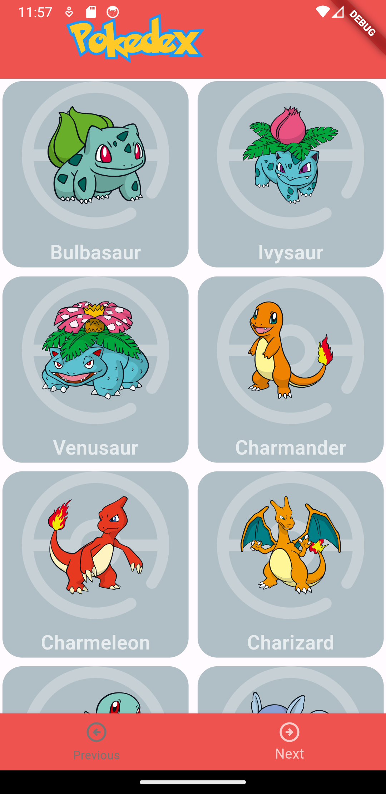
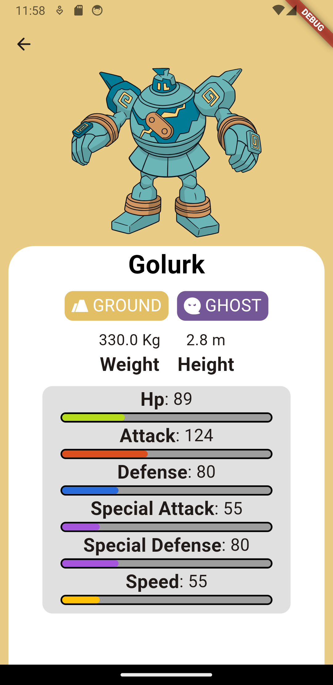

# Pokedex con Flutter

El típico proyecto para comenzar una practicar una nueva tecnología, decidí hacer una Pokedex para poder practicar: 

* Consumo de APIs
* Diseño de Widgets
* Estructurar un proyecto en Flutter

## Capturas de pantalla

<figure>
  <figcaption><b>Página principal</b></figcaption>
  
</figure>

<figure>
  <figcaption><b>Vista de pokemon</b></figcaption>
  
</figure>

